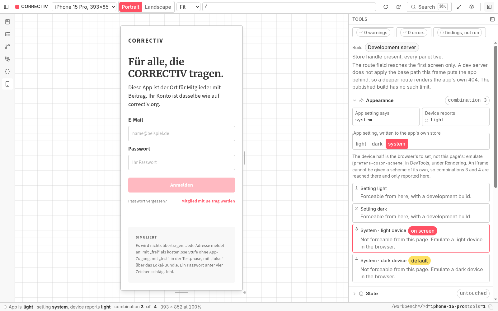

# CORRECTIV app

A prototype community app for CORRECTIV members: the organisation's investigations,
fact checks, Salon5 radio, CrowdNewsroom callouts, the Faktenforum and the membership
club. This repository holds the app, the platform-free core it is built on, the design
tokens they are drawn with, and the site that publishes all of it.

## Start with the handbook

**[faktenforum.github.io/correctiv-app](https://faktenforum.github.io/correctiv-app/)**
is the front door, and the app is a link inside it. One site carries the repository's
documentation, the inventory of what the app reads, the architecture diagrams, a
reference generated from the core, and the running app in a device frame. It renders
this repository's Markdown in place, keeps no copy of it, and is rebuilt on every push
to `main`. Four addresses worth going to directly:

| | |
| --- | --- |
| [`/workbench`](https://faktenforum.github.io/correctiv-app/workbench) | The app itself in a phone or tablet frame, with an inspector for its state, its console, its palette and its layout. No install, no emulator. |
| [`/sources`](https://faktenforum.github.io/correctiv-app/sources) | What each part of the app reads: a live source, sample data standing in for an API that does not exist yet, or nothing at all. |
| [`/decisions`](https://faktenforum.github.io/correctiv-app/decisions) | Every architecture record, and which of their claims a later one has made false. |
| [`/architecture`](https://faktenforum.github.io/correctiv-app/architecture) | One core, four ports, and the article path end to end. |

The screens work end to end and the backends behind them do not exist yet. Sign-in,
the club join, the callouts and the Faktenforum claims run on typed sample data shaped
like the responses that will replace it, which the app says on screen. Articles, the
newsletter archive, search, Salon5 audio and video are live.

## How this is built

The app is built by AI-assisted development, "vibe coding", with a human directing the
work and deciding what lands. What keeps it honest is checkable. Every architectural
choice is recorded in [`adr/`](adr/README.md), and a claim that a later decision made
false is struck through where it stands, with a link to the record that voided it,
instead of being quietly rewritten. Every source the app reads is inventoried in
[SOURCES.md](SOURCES.md), measured by hand against the live source on a day the file
states, with that date typed a second time into the site's manifest and a test that
fails when the two part. `npm run check` at the root runs typecheck, lint, format and
tests in seconds, and [TROUBLESHOOTING.md](TROUBLESHOOTING.md) collects the
defects that passed exactly that, which is why a green check is not treated as
evidence here.

## Getting started

Node 20.19 or newer.

```bash
npm install
npm run check       # typecheck, lint, format, tests, in seconds, no device
npm run app         # the app in a browser, at localhost:8081/app/, Fast Refresh
npm run android     # a dev build on an emulator or a device
npm run build:web   # static export to apps/mobile/dist/
```

Only `npm run android` needs the Android toolchain, JDK 17 and an Android SDK with
`ANDROID_HOME` set. iOS is maintained in code and has not been built.

The handbook and its workbench are two servers locally, and the site's dev server
proxies the app under itself so that the frame and the app stay one origin:

```bash
npm run handbook    # the site, at localhost:5173
npm run app         # the app it frames, at localhost:8081/app/
```

The app's dev server carries the same `/app` base the deploy gives it, so the assets
resolve the same way in both. Expo Router applies that base when the export is built
and not in the dev server, so locally the frame reaches the app's first screen and a
deeper route renders the app's own 404. [TROUBLESHOOTING.md](TROUBLESHOOTING.md) has
the measurement and what to do instead.

The published demo reads live content and falls back to a snapshot committed in the
repository, so it works without a network. `npm run offline-articles` and
`npm run offline-podcasts` refresh that snapshot; run them and commit the result
before you want the demo to show recent articles.

## Where things live

- [`packages/app-core`](packages/app-core) holds every piece of behaviour and imports
  no UI framework and no platform SDK.
- [`apps/mobile`](apps/mobile) is the app, on Expo and React Native, for iOS, Android
  and web.
- [`apps/handbook`](apps/handbook) is the published site, including `/workbench`.
- [`packages/design-tokens`](packages/design-tokens) and [`tokens/`](tokens/README.md)
  are the colours, spacing and type scale, vendored from CORRECTIV's design tokens.

[ARCHITECTURE.md](ARCHITECTURE.md) is how they fit together, [AGENTS.md](AGENTS.md) is
how to work in here, and [RELEASE.md](RELEASE.md) is how a build reaches a device.

## Licence

AGPL-3.0-or-later, see [`LICENSE`](LICENSE). The MIT notice for the parts scaffolded
by `create-expo-app` and for the bundled fonts is kept in
[`apps/mobile/NOTICE.md`](apps/mobile/NOTICE.md); the design tokens are vendored from
[correctiv/wp-design-tokens](https://github.com/correctiv/wp-design-tokens)
(GPL-2.0-or-later). Sample content and images are CORRECTIV material, and nothing is
on an app store.
