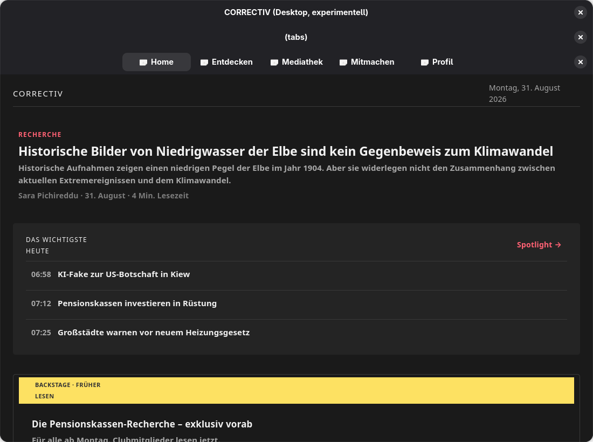

# @correctiv/desktop — an experimental GTK4 host

**This is a feasibility demonstration. It is not a release target, it is not built by
CI, and nothing ships from it.** It exists to answer one question with evidence rather
than argument: can the CORRECTIV app grow a desktop target without the core moving?

It can. The core did not move. What follows is what runs, what does not, and what this
does not prove.

The host is [gjsify](https://github.com/gjsify/gjsify)'s React-Native-on-GTK4 layer
(`@gjsify/react-native` 0.45.0), which renders React Native's view vocabulary onto GTK4
and Adwaita. [ADR 0012](../../adr/0012-a-list-virtualizer-for-the-unbounded-lists.md)
and [ADR 0013](../../adr/0013-native-tabs-and-a-web-tab-bar-of-its-own.md) already named
this host as a reason for two decisions; this is that host, built.



## What actually runs

| | |
| --- | --- |
| **Routes** | 27 route files (25 openable hrefs + 2 layouts). **22 of 25 rendered** when that was last swept; the three exceptions are below. A newer defect briefly stopped the sweep from being re-run at all — see [*The profil crash, fixed*](#the-profil-crash-fixed) — and is now resolved. |
| **The vertical slice** | Start → Artikel → Reader, working, over WebKitGTK. |
| **Audio** | Working, on GStreamer. Position advances, live streams are detected, and the port's re-entrancy contract holds. |
| **Chrome** | Adwaita's own. `Stack` is an `Adw.NavigationView`, `Tabs` an `Adw.ViewStack` + `Adw.ViewSwitcher`. Nothing restyles a header bar or a button. |
| **Colour** | The app's own tokens, both palettes, generated from `packages/design-tokens/theme.css`. The screenshots here are the dark one. |
| **Video** | A placeholder. Deliberately — see below. |

### The reader

`buildReaderHtml` in the core produces a complete, self-contained document, and every
host's job is to display it. WebKitGTK displays it, so the article looks the way it does
on the phone — including the typefaces, because the reader embeds its own
base64-subsetted fonts and that mechanism works unchanged inside WebKit.


### Audio, measured rather than screenshotted

A screenshot of the player proves a screen rendered, not that audio decoded. `npm run
audio-probe` drives the backend directly and prints what arrived:

```
--- bundled mp3 ---            --- live radio ---
ticks:        9                ticks:        115
loaded:       true             loaded:       true
position:     0.00s -> 2.87s   position:     0.00s -> 5.45s
durationSec:  97.47            durationSec:  0.00
live:         false            live:         true

--- the port's re-entrancy contract ---
ticks emitted from inside a command: 0 (must be 0)
```

That last line is the one worth having. `AudioBackend` states that a command must never
call the status listener synchronously, because a backend that emitted from inside
`pause()` once killed the app with `RangeError: Maximum call stack size exceeded` a
minute into an episode ([ADR 0006](../../adr/0006-one-core-two-hosts.md)). The probe
asserts the property rather than trusting the implementation.

### The profil crash, fixed

Home did not render at all for one merge, and it took every route with it, because
the tab stack mounts all five tabs from `/`. `(tabs)/profil.tsx` rendered three
`<Typo onPress>` under "Ihr Impact"; the layer refuses `onPress` on a `Gtk.Label` —
correctly, a label emits no `clicked` — and the uncaught `PrimitiveError` ended the
tree before anything else ran, `CORRECTIV_DESKTOP_ROUTE` included.

It arrived with [ADR 0018](../../adr/0018-removing-the-guest.md): those rows were inside
`{membership.isMember && …}` and were reached by nobody, so removing the guest branch
made them unconditional. Measured on one profile against two bundles of the same host:
the tree from before the merge captured Home at 92 125 bytes, the tree after it threw
and captured 12 848.

The remedy is the one the refusal names — wrap the three rows in a `Pressable`, which
is what the rest of this app already does for a tappable line of text — done in the
phone's screen, so it is correct on both hosts. A clean run now captures Home again,
at 93 470 bytes, with no `PrimitiveError` in the log.

## What does not work

**Three tab routes cannot be deep-linked.** `router.replace('/mediathek')`,
`'/mitmachen'` or `'/profil'` enters an infinite update loop — React error #185, with
`gtk_widget_set_child_visible: assertion 'GTK_IS_WIDGET (widget)' failed` repeating
about thirty times a second. The screens themselves are fine: starting on Home mounts
all five tabs with **zero** errors, now that [the profil crash](#the-profil-crash-fixed)
above is fixed, and `/entdecken` deep-links cleanly.

It is TWO defects that look like one, and separating them took a control run. Patching
the host to hide a page before removing it takes the criticals from 296 and 131 down to
**0, 0, 0** over three runs — while the React errors stay at 5, 5, 5. So:

* the **criticals** are libadwaita's, reached through `@gjsify/gtk-host`:
  `adw_view_stack`'s `stack_remove()` clears `visible_child` and leaves
  `last_visible_child` pointing at a page whose widget it has just dropped, so every
  later reader dereferences it. The host's `keyed` reorder removes all children and
  re-adds them, which walks into that once per page per render. `Gtk.Stack` does not
  have the bug.
* the **loop** is the tab router's, in `@gjsify/react-native`: the effect that selects
  the visible page has no dependency array and a guard that only terminates once the
  selection has taken, so a name the stack does not carry yet never settles.

Both are fixed upstream in gjsify; this app picks them up on the next version bump. The
libadwaita half is being reported to GNOME.

**Video is a placeholder**, and that is a decision rather than a limitation of the
toolkit — the YouTube embed would in fact load inside WebKitGTK. `@gjsify/video` is
GJS-only while ADR 0032's ship path puts macOS and Windows on Node + node-gi, so real
video here would work on one of the three desktop targets. Both video paths render an
honest notice in the app's own voice instead.

**The reader loses its fade.** `Animated` is not implemented in the layer (tier P3: "a
subsystem rather than a component — doing it badly is worse than not doing it"), so
`src/app/artikel.tsx` is a variant of the phone's screen with the 160 ms header fade
removed. The header still hides and returns; it cuts instead of fading.

**A colour-scheme change needs a restart.** Adwaita's chrome follows the setting
immediately, but the app's own token colours are resolved when their CSS class is
minted, so switching mid-session would leave half the window in each scheme. The palette
is read once, at startup.

**Smaller, each named where it happens:** no icons in the tab switcher (the router's
`Tabs.Screen` takes `title` only); no mini player (there is no bottom bar to pin it
above, and the switcher's header-bar slot will not survive a wrapper); no lock-screen
metadata (MPRIS is the desktop counterpart and is not built); the two brand typefaces
are absent from the *chrome* (Pango falls back to the system font; the article body is
unaffected); `Bleed` does not bleed, because GTK does not clamp a negative margin — it
measures with it; and a chip row does not wrap, because `Gtk.Box` cannot.

## How to run it

Needs GTK4, libadwaita, WebKitGTK 6.0 and GStreamer (base + good). On Linux it also
needs `gjs`; on macOS and Windows it does not — see *Two hosts, one source* below.

```bash
npm install                                 # from the repo root
npm run build     -w @correctiv/desktop     # dist/app.gjs.mjs   (Linux)
npm run start     -w @correctiv/desktop
```

**The app opens on the door.** Since [ADR 0016](../../adr/0016-a-door-at-the-root-and-an-entitlement-not-an-amount.md)
the root layout renders `LoginGate` instead of the navigator while the session is not
admitted, on this host as on the phone. Sign-in is simulated: any address gets in, with
any password of four characters or more. What that means for the two aids below is that
**they are behind the door too** — no route is mounted until a session is admitted, so
`CORRECTIV_DESKTOP_ROUTE` cannot land, and the log says
`CORRECTIV_DESKTOP_ROUTE was never applied within 15000 ms` rather than pretending. The
route sweep reads that as a failure, on purpose: a run that never left the door has
nothing to say about the route it was asked for.

So sign in once. The session persists to
`$XDG_CONFIG_HOME/correctiv-desktop/settings.ini`, where every later run finds it.

Three development aids, all environment-gated and all no-ops otherwise:

```bash
# Start on a particular route — there is no way to drive the UI from outside yet.
# Needs an admitted session in the profile; see above.
CORRECTIV_DESKTOP_ROUTE=/spotlight npm run start -w @correctiv/desktop

# Capture the window to a PNG and exit. In-process, because GNOME 45+ refuses
# org.gnome.Shell.Screenshot to an unsandboxed caller and this session is Wayland.
npm run screenshot   -w @correctiv/desktop   # writes dist/screenshot.png

npm run audio-probe  -w @correctiv/desktop   # drives the audio port, prints the ticks
npm run route-sweep  -w @correctiv/desktop   # opens every route, reads the log
```

### Two hosts, one source

Linux runs the `--app gjs` bundle on the distribution's own GJS. macOS and Windows have
no system GJS at all, so there the same source is built `--app node` and runs on Node
with [`@gjsify/node-gi`](https://www.npmjs.com/package/@gjsify/node-gi) bridging `gi://`.
ADR 0024 makes the same split for packaging: on Linux a `Depends: gjs` is honest, and
bundling ~100 MiB of interpreter beside it would not be.

Nothing in `src/` is host-conditional — the bundler rewrites every `gi://` import into a
lazy `requireGi()` call, so the split lives entirely in how the bundle is produced:

```bash
npm run build:node -w @correctiv/desktop     # dist/app.node.mjs  (macOS, Windows)
npm run build:all  -w @correctiv/desktop     # both

npm run start:node -w @correctiv/desktop     # run the other bundle deliberately
npm run route-sweep -w @correctiv/desktop -- --host node
```

**Run the node host from Linux.** It is the only machine that can run both, so it is the
only place the macOS/Windows bundle gets exercised before it reaches those machines.

Two things are known to be missing on the new targets, and neither is in this tree:

| | state |
|---|---|
| **The reader's WebView** | `gi://WebKit` is in none of the shipped GTK runtime bundles. macOS has a separate WKWebView shim behind the same namespace, but it declares the node runtime unsupported and implements no `decide-policy`, which is what the navigation gate uses. Windows has no engine at all. |
| **Live radio** | the bundles carry an audio-only GStreamer plugin set with no `souphttpsrc`, so an `https://` stream finds no source element. The bundled episode plays. |

And one defect is measured and open upstream: a GTK app on `@gjsify/node-gi` dies
intermittently in the GI bridge (SIGSEGV or SIGABRT, roughly one run in three here),
which is a known nondeterministic lifetime bug in the bridge rather than anything this
app does. `npm run start:node` reports the signal by name rather than swallowing it.

## How it is put together

`ARCHITECTURE.md` puts the cost of a host at one file implementing four interfaces, and
[ADR 0007](../../adr/0007-removing-the-nativescript-host.md) says that estimate stopped
being theoretical when the NativeScript host was removed. It held here too.

```
src/platform/       the four ports        storage.ts (GKeyFile + Gio), content.ts
src/audio/          the fourth port       GStreamer playbin3, ticks on a 500 ms timer
src/generated/      tokens.generated.ts   from packages/design-tokens/theme.css
src/shims/          what gjsify does not answer yet — see below
src/overrides/      VideoFrame, the placeholder
src/app/            27 route files: 24 re-export the phone's screen, 3 are variants
```

**The route tree is re-exports, not forks.** Twenty-four of twenty-seven files are one
line. The three that differ — `_layout`, `(tabs)/_layout`, `artikel` — each carry a
header saying why, and `test/route-tree.test.ts` fails if the phone grows a screen this
host does not.

**The shims are the interesting part**, and every one is a real mapping or a named
refusal — never a silent no-op, because GTK's failure mode is exit 0 and a prop nobody
applied is indistinguishable from an application bug forever.

`src/shims/react-native.tsx` is the one that earns its place. The app passes props the
GTK layer refuses BY NAME in about 110 places, and every one of those refusals is
correct; this is where each gets one deliberate answer instead of 110 render-time
throws. `accessibilityLabel` and `accessibilityState` are **implemented** through
`Gtk.Accessible.update_property()`, which is what the refusal message points at.
`hitSlop` is dropped, correctly — it is a concession to a fingertip on a platform whose
pointer is a mouse. It also flattens `style` arrays, translates six style properties GTK
spells differently, gives `justify-between` the spacer child its refusal asks for, and
gives a `Pressable` an inner box because a `Gtk.Button` takes one child and cannot be an
overlay.

Four shims the brief expected are **absent on purpose**: `expo-linking`,
`expo-web-browser`, `expo-constants` and `expo-system-ui` are declared in the app's
`package.json` and imported nowhere, so shimming them would be dead code pretending to
be coverage.

## Checks

`npm run check` at the repo root covers this workspace: the typecheck, the lint, and
twelve tests. They are the guards a green build does not give you.

- **`test/support-gate.test.ts`** reproduces the build-time support gate that
  `gjsify build --dialect react-native` would provide. This build does not use that flag
  (`gjsify.config.mjs` says why), so the gate is reproduced here against the same
  published support table — and it runs in a second, with no GTK, and reads the app's
  source, which is where the change will come from.
- **`test/route-tree.test.ts`** fails when the two trees drift.
- **`test/tokens.test.ts`** regenerates and byte-compares, then restores the committed
  bytes — "drift is a failed PR, not a discovery"
  ([ADR 0010](../../adr/0010-design-tokens-as-a-shared-package.md)) — and asserts the two
  properties the generator exists to guarantee: whole-pixel spacing, and no token name
  reachable from two scales one family reads.

**What none of that proves is that anything looks right.** The same warning
[TROUBLESHOOTING.md](../../TROUBLESHOOTING.md) opens with applies with more force here,
because this host's refusals happen at RENDER time, per screen: a green check, a green
typecheck and a successful build are all compatible with a screen that throws the moment
it is opened. `npm run route-sweep` is the answer to that — it opens all 25 routes and
reads the log — and it is how the three broken tab routes above were found.

## What this does not prove

- **Nobody has used it.** Every screen here was opened by a script and photographed. No
  one has clicked a tab, scrolled a feed with a mouse wheel, resized the window or
  tabbed through a form. The tab switcher in particular has never been *clicked*: the
  deep-link failure above is the only thing known about selecting a tab, and clicking one
  goes through a different path entirely.
- **Linux only.** ADR 0032 puts macOS and Windows on Node + `@gjsify/node-gi`, and the
  reader there would need `@gjsify/webkit-native` (macOS) or a backend that does not exist
  yet (Windows). Neither was attempted. The reader's WebKit shim is the file that would
  have to grow that seam.
- **No performance measurement of any kind**, on any screen.
- **The accessibility work is unverified.** Labels and states are applied through the
  right API; nobody has listened to Orca read a screen.
