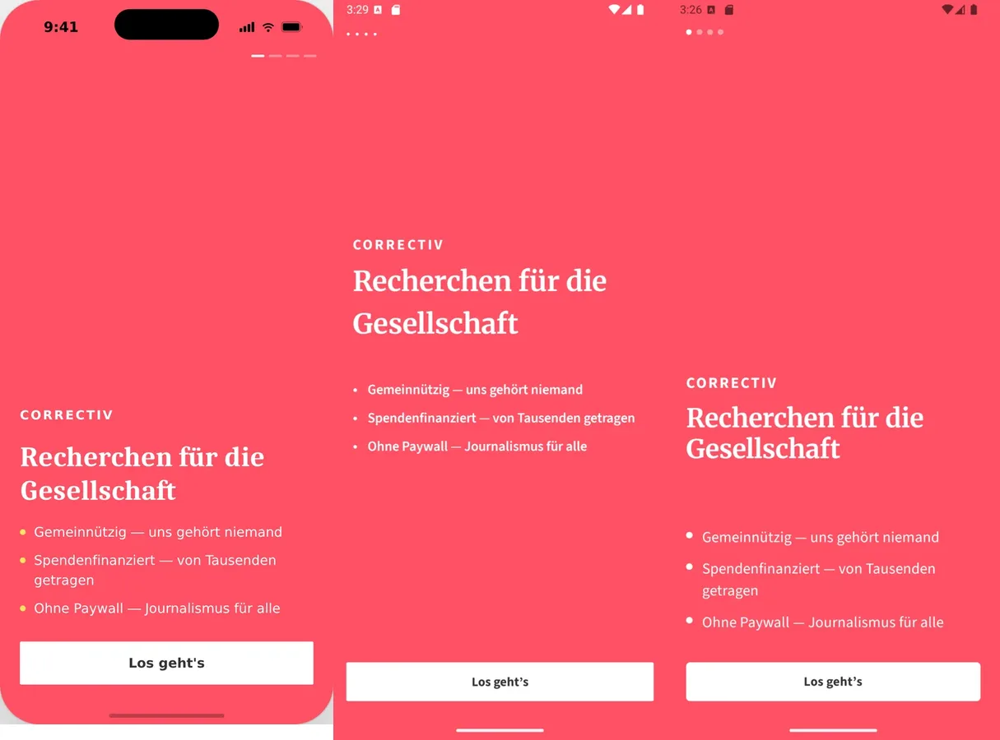
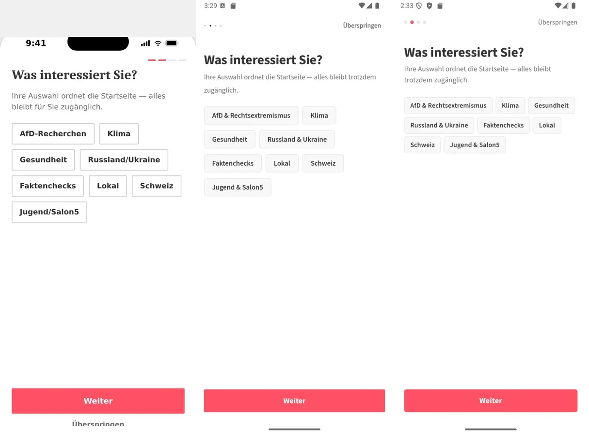
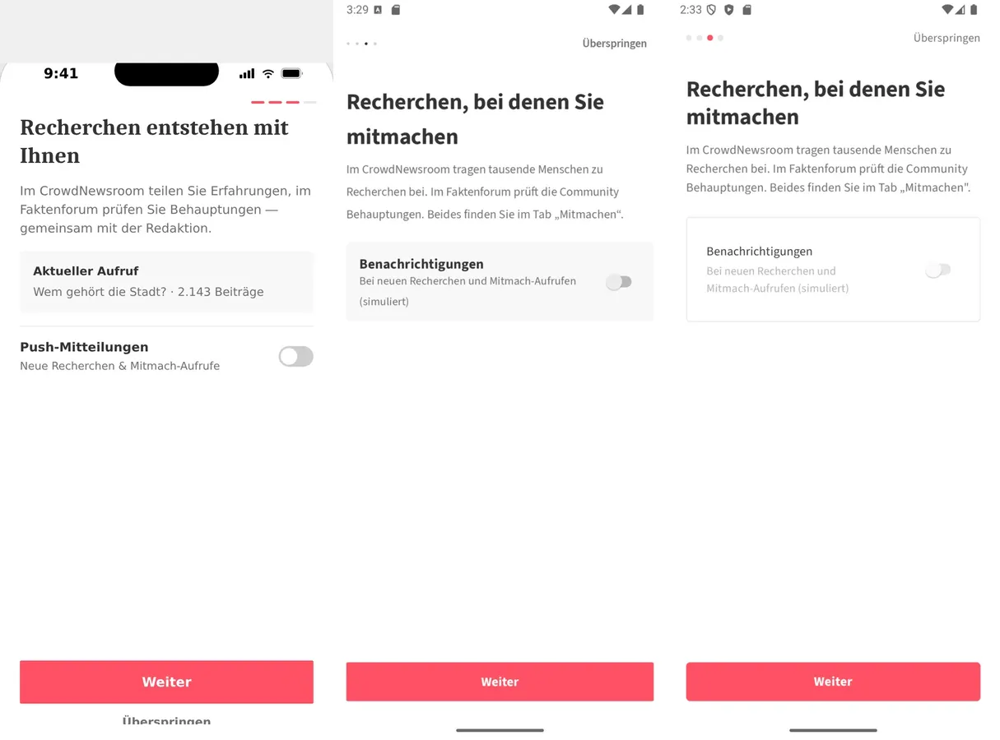
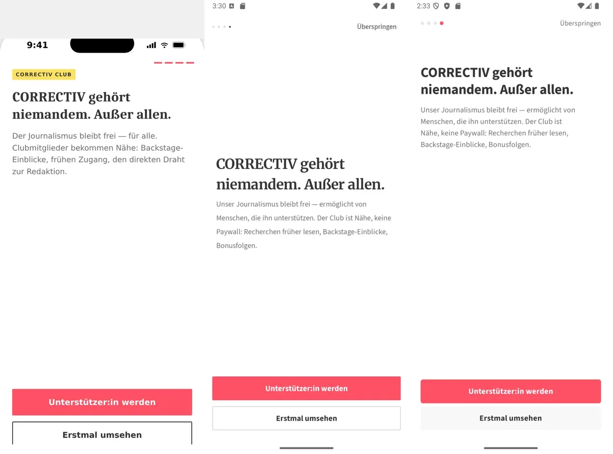
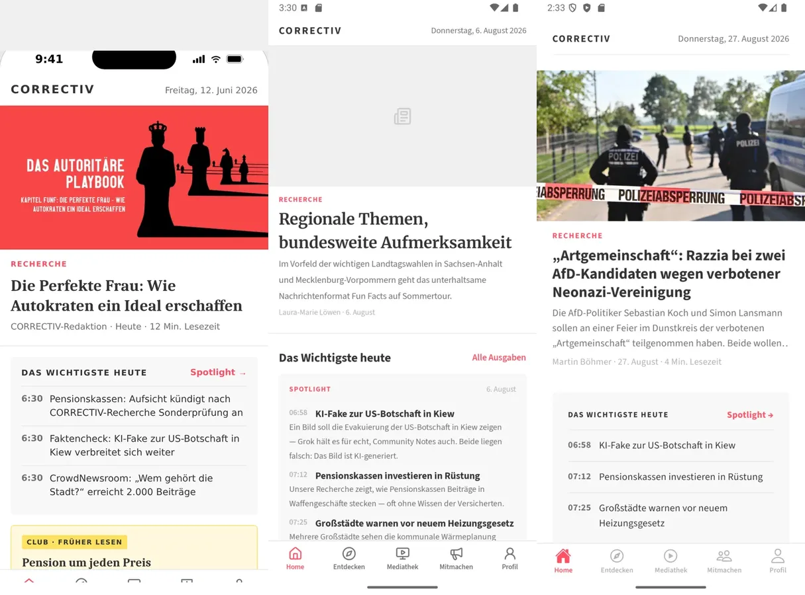
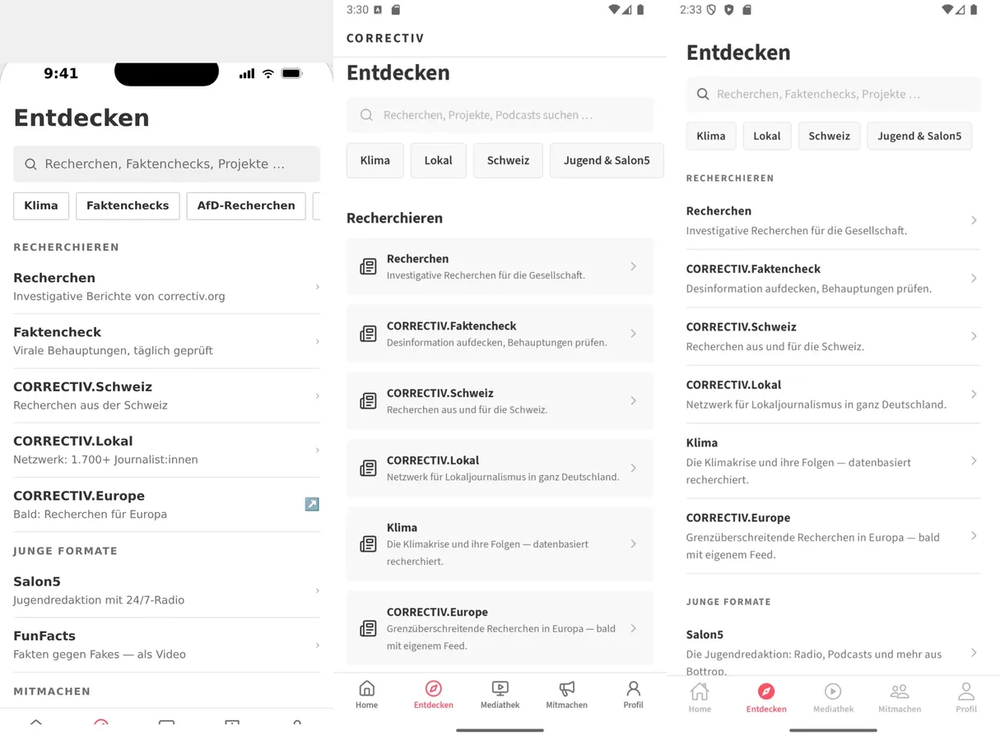
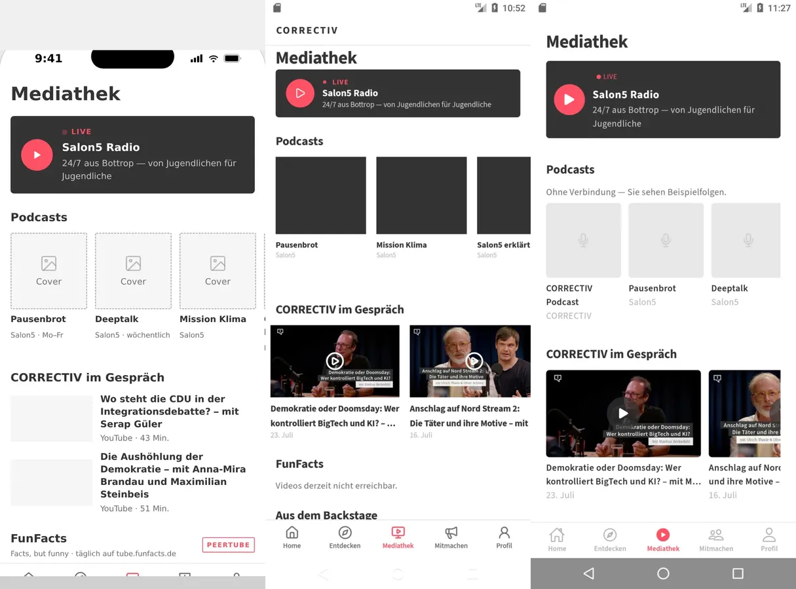
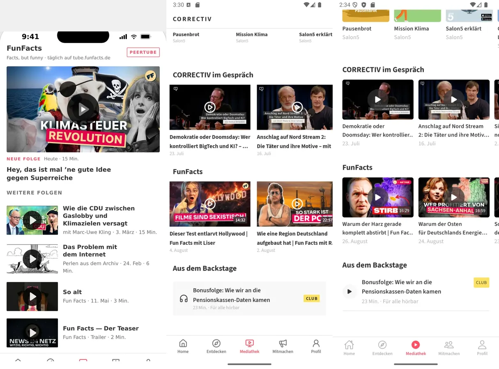
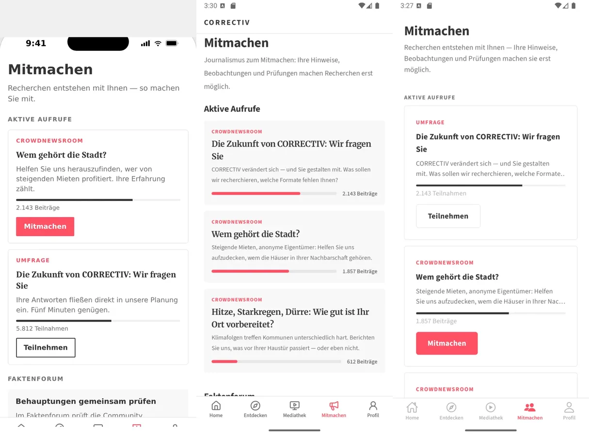
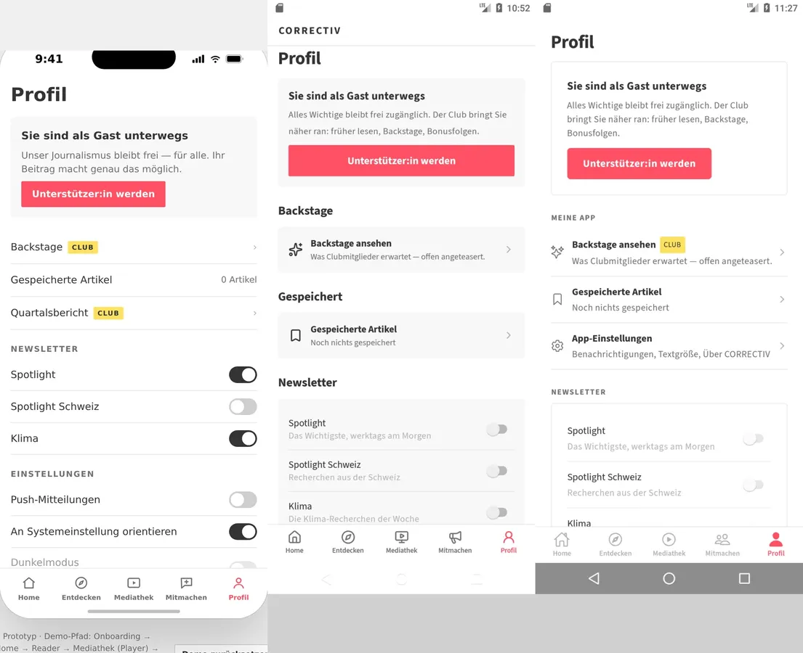

# Screens — the three versions, shot the same way

A visual record of every screen in all three versions of this app, captured with the
same step names so they can be read side by side.

It exists because of the rule in [`AGENTS.md`](../AGENTS.md): a green check is not
evidence. The weaker version of that rule — extracting text with `uiautomator dump`
and `document.body.innerText` — proves the right *words* are on screen and nothing
about how it looks. Every finding in the table below survived a green build, a green
typecheck and a green test run, and each one was found by looking at a picture.

| Set | What it is | Worth as a reference |
| --- | --- | --- |
| [`draft/`](draft/) | The design draft in [`docs/`](../docs/) rendered in Chrome at 402×874 | **The** visual target. Generated from the `design-entwurf` sibling repo, not app code |
| [`nativescript/`](nativescript/) | `apps/mobile`, superseded by [ADR 0004](../adr/0004-react-native-pivot.md) | Still the closest match to the draft in places. Read it for layout decisions, do not add features to it |
| [`expo/`](expo/) | `apps/mobile-rn`, the live app | The thing under test |

Emulator `Medium_Phone` (Android 7.0 API 36, 1080×2400); the draft is pinned to
light mode so it matches.

The draft is fixed — it only moves when the design does (last shot 2026-08-05 at
`26ef0c9`). **Both app sets are re-shot together**, because since
[ADR 0006](../adr/0006-one-core-two-hosts.md)
they share a core and a core change lands in both — the NativeScript set stopped
being a frozen reference the moment its behaviour started coming from the same place
as the Expo app's. Both are from 2026-08-06 at `9842b27`.

**A screenshot is only evidence of the build it came from.** The set this commit
replaces was shot between 13:40 and 14:21 from APKs built at 14:46, and `9842b27`
landed at 15:12 — so every picture in it showed an app one commit out of date, and
one of them showed a feature that commit had deleted (see the third round below).
Shoot after building, from the build you mean to document, and write down the commit.

## Three-way comparison

Order in each image: **draft · NativeScript · Expo**.

| | |
| --- | --- |
| [Onboarding 1 — welcome](compare/01-onboarding-welcome.webp) |  |
| [Onboarding 2 — interests](compare/02-onboarding-interests.webp) |  |
| [Onboarding 3 — push](compare/03-onboarding-push.webp) |  |
| [Onboarding 4 — club](compare/04-onboarding-club.webp) |  |
| [Home](compare/10-home-top.webp) |  |
| [Entdecken](compare/30-entdecken.webp) |  |
| [Mediathek](compare/40-mediathek.webp) |  |
| [Mediathek, scrolled](compare/41-mediathek-mid.webp) |  |
| [Mitmachen](compare/50-mitmachen.webp) |  |
| [Profil](compare/60-profil.webp) |  |

The reader has no montage: the draft has no reader screen to compare against — its
detail view is an overlay the Expo app does not build — and the NativeScript tour
has no reader step, because it reaches its screens by tapping rather than by deep
link. Read [`expo/22-reader.webp`](expo/22-reader.webp) on its own.

At mid-scroll the Mediathek columns are not showing the same section: the draft
organises the Mediathek per channel, so scrolling twice lands it inside FunFacts
while both apps are still on the shared rails. It is in the table because the club's
bonus row only becomes visible there.

## What the comparison found

| Seen in a screenshot | Cause | Which version was right |
| --- | --- | --- |
| A video card grown into a full-screen black rectangle | `w-64` does not exist in the token scale, so the class was dropped and `aspectRatio` scaled the height off the title's width | draft & NativeScript |
| Podcast covers half size, titles breaking mid-word | `w-32` means 64px here, not Tailwind's 128 | both |
| Play buttons at half size everywhere | same 2px-per-unit scale: `w-10` is 20px, `w-12` 24px | both |
| Failed thumbnails rendered as a broken-image glyph on black | expo-image's own placeholder; on this project failing thumbnails are routine | NativeScript, which degrades quietly |
| Home shouting and Mediathek whispering | the dark treatment was on Home's small tile instead of Mediathek's radio banner | both |
| A live badge with two dots | the component draws the dot and the label repeated it | both |
| No date in Home's masthead | never built; `formatDateWeekdayDe` sat unused in the core | both |
| Hero without kicker or byline, image inset instead of edge to edge | never built | both |
| No participate module and no Backstage card on Home | never built | both |
| All three callouts introduced themselves as CROWDNEWSROOM with the same coral button | the kind was not in the data | draft, which gives a survey its own words and a quieter button |
| Nothing marked which profile entries the club unlocks | never built | draft, with its yellow CLUB badge |
| The reader's error state was a dead end, and links to date-less articles left the app | an internal-link rule written from one URL shape; Spotlight pieces have no date in the path | neither — found while shooting the reader |

Fixed in [#30](https://github.com/faktenforum/correctiv-app/pull/30) (which also adds
`__tests__/no-numeric-utilities.test.ts`, so the token-scale trap cannot come back
silently), [#31](https://github.com/faktenforum/correctiv-app/pull/31) and
[#32](https://github.com/faktenforum/correctiv-app/pull/32).

One finding came from the capture itself rather than from a comparison: the tour's
article deep link used a URL I had reconstructed from a headline, and it 404s. The
screenshot then documented the reader's error state — which turned out to be a dead
end with no retry and no way to open the page in a browser. Both are fixed; the tours
now use a URL read off the live feed.

Two differences are deliberate and stay: Expo shows video channels as horizontal
rails where the draft uses a vertical list (the rail is what NativeScript settled
on too), and app settings live on their own route instead of inline in the profile,
because they need to be deep-linkable.

## Second round, 2026-08-06

Same method, on the set above. Four came from reading the draft's markup next to the
screenshots, three from walking the app.

| Seen | Cause | Which version was right |
| --- | --- | --- |
| The hero had no kicker at all on most days | it came from the feed's badge, and the main feed deliberately defines none | draft & NativeScript, which give the hero one unconditionally |
| No reading time in the byline | never built. correctiv.org publishes its own figure as a `twitter:label`/`twitter:data` pair, so it is read, not estimated | draft |
| The briefing quoted one item in full where the draft indexes three | teasers in a card the draft built as an agenda | draft |
| "Spotlight →" / "Alle Ausgaben" led nowhere | no archive route existed, although the core carries several issues | both — hence `/spotlight` |
| Rails clipped 24px short of the screen edge, the second card cut mid-word | the scroller sat inside the text column instead of bleeding out of it | draft, whose rail is a full-width scroller with the padding inside |
| Back was a dead end on any directly opened route | 15 screens called `router.back()` with no history to go back to | neither — found by opening `/spotlight` as a web address |
| Tab switches did not animate | bottom tabs default to `animation: 'none'` | NativeScript, whose native tabs animate |

Two of these were faults in the tour rather than in the app, and both had produced a
committed screenshot that documented nothing:

- `82-player` was blank because the step tapped the bonus episode on the *backstage*
  route, where it does not exist — it is on Mediathek. The step reported MISS, the
  tour walked on, and nobody looked at the picture.
- `83-video` documented "Kein Video ausgewählt." because `correctiv://video` carries
  no video: that screen takes it from the core's store.
- `20-detail-article` and `21-detail-mid` are gone. They showed Home, not an article
  detail, they were stale, and the Expo app has no counterpart to the draft's detail
  overlay — the reader (`22`, `23`) is it.

Fixing `83-video` surfaced the round's one real defect: the YouTube embed answered
**Error 153, "Video player configuration error"**. The embed was the WebView's
top-level document, which sends no referrer, and YouTube requires one — the same URL
fails identically in the emulator's own Chrome. It now loads inside an `<iframe>` on
a page with a `baseUrl`, which is what the web target always did. The error text is
gone; the frame stays black on this emulator, so **that playback works is not
verified** and belongs on the device test.

## Third round, 2026-08-06 — both apps re-shot at `9842b27`

Rebuilt first this time, which is where the rule at the top of this file comes from.

| Seen | Cause | Which version was right |
| --- | --- | --- |
| The replaced set stopped the bonus episode at 60 seconds, offered the club in a sheet, and labelled the row "60 Sek. anspielen" | those APKs predated `9842b27`, which dropped the preview gate — club audio has no length limit any more | HEAD, where both apps read "Für alle hörbar" |
| The reader's byline reads "04. August 2026" where every other date in the app reads "4. August" | `reader-html.ts` prefers `article.publishedText` — the date as the page printed it — over `formatDateDe`, and correctiv.org prints the leading zero. The field's own doc comment gave "4. August 2026" as its example | the app's own format — changed after this set was shot, see below |
| The draft's onboarding bullets have yellow markers; both apps draw them white | never built | draft |
| NativeScript puts the onboarding block at the top where the draft and Expo sit it at the bottom | — | draft & Expo |
| Home's hero is a grey placeholder in both apps | today's lead article has no cover at all — no `og:image` on the page, no image in the feed item. Both hosts degrade quietly, which is what the first round asked for | both, and not a defect |

The result this round existed to check is the one that is easy to miss because
nothing looks wrong: the preview gate was removed **in the core**, and it is visibly
gone from both hosts — the NativeScript build reads "Für alle hörbar" without a line
of NativeScript changing. That is [ADR 0006](../adr/0006-one-core-two-hosts.md)
working, and a screenshot is the only place it shows.

The date row was the round's one open decision, and it is settled: uniform wins over
the publisher's wording. The reader now formats `publishedAt` itself —
`formatDateDe(article.publishedAt) || article.publishedText` — which keeps
`publishedText` for the pages that carry no parsable date, since the formatter returns
an empty string for one it cannot parse. **The reader shots in this set still read
"04. August 2026"**: they predate the change, which is the rule at the top of this file
applying to itself.

## Regenerating

The emulator needs a window — headless dies on SELinux denying `execheap` to
SwiftShader's shader JIT.

Both apps share the package id, so only one is installed at a time and each install
needs the other uninstalled first — they are signed with different keys, and `adb
install -r` answers a mismatch with `INSTALL_FAILED_UPDATE_INCOMPATIBLE`.

```bash
# Expo build
cd apps/mobile-rn/android && ./gradlew assembleRelease && cd -
adb uninstall org.correctiv.app.prototype
adb install apps/mobile-rn/android/app/build/outputs/apk/release/app-release.apk
OUT=out/expo bash screens/tools/tour-android.sh          # the five tabs
OUT=out/expo bash screens/tools/tour-android-routes.sh   # the pushed routes, by deep link

# NativeScript build — let CI do it. `ns build` needs the two workarounds in
# .github/workflows/release-android.yml (a skipped doctor preflight and a
# redirected Vite output dir) before it produces an APK at all.
gh workflow run release-android.yml --ref main        # or reuse the last run
gh run download <run-id> -n release-nativescript -D /tmp/ns
adb uninstall org.correctiv.app.prototype
adb install /tmp/ns/correctiv-app-nativescript-*.apk
OUT=out/nativescript ACTIVITY=com.tns.NativeScriptActivity bash screens/tools/tour-android.sh

# Design draft — only when the design itself changed
python3 -m http.server 8098 --directory docs &
node screens/tools/tour-draft.mjs http://localhost:8098/index.html out/draft \
  --tour=screens/tools/tour-draft.json
```

Then convert for the repo — full-resolution PNGs are ~1.1 MB each, WebP at 540px
is ~50 KB and still legible — and rebuild the montages from the three sets:

```bash
for set in expo nativescript; do
  for p in "out/$set"/*.png; do
    magick "$p" -resize 540x -strip -quality 82 "screens/$set/$(basename "$p" .png).webp"
  done
done

for n in 01-onboarding-welcome 02-onboarding-interests 03-onboarding-push \
         04-onboarding-club 10-home-top 30-entdecken 40-mediathek \
         41-mediathek-mid 50-mitmachen 60-profil; do
  magick "screens/draft/$n.webp" "screens/nativescript/$n.webp" "screens/expo/$n.webp" \
    -resize 405x -background white +append -strip -quality 82 "screens/compare/$n.webp"
done
```

The web export is worth a look in the same pass, because it is the only place where
back-without-history and a directly opened route can be tested at all:

```bash
npm run build:web -w apps/mobile-rn
node screens/tools/serve-clean.mjs apps/mobile-rn/dist 8099
```

`serve-clean.mjs` maps `/artikel` to `artikel.html` the way GitHub Pages does. A
plain `python3 -m http.server` does not, and then Expo Router renders its
unmatched-route page — which looks exactly like a broken route in the app.

## Caveats

- The draft is one interactive shell inside an iOS frame, so its tour has to click
  through the app the way a user would; the Expo routes are reached by deep link
  (`correctiv://<route>`) instead, which cannot drift when a layout changes.
- Podcast series show sample data in the Expo shots: Castopod, Icecast and
  `tube.funfacts.de` serve a Let's Encrypt chain that this emulator image does not
  trust. That is an ops finding, not an app defect — see
  [`TROUBLESHOOTING.md`](../TROUBLESHOOTING.md#data-sources).
- The draft's content is fixed sample data with a fixed date; both builds pull live
  feeds, so the articles differ between the sets by design — and Home's hero can be
  an article with no cover image, as it is in this round.
- The NativeScript set is shot from the release APK the CI workflow builds, signed
  with the in-repo test key, where earlier rounds used a local debug build. Nothing
  visible depends on that, but it is a different artifact.
- `83-video` shows a black frame. The embed's error message is gone, but this
  emulator image renders no YouTube video — see the second round above.
- On the web export, Home's articles come out of the bundled snapshot, not the
  network: correctiv.org sends no `Access-Control-Allow-Origin`, so every feed
  request fails in a browser and the store's cascade lands on the bundle. The layout
  is still judged on the emulator shots, because the web build shows a snapshot as
  old as the last `npm run offline-articles`.
