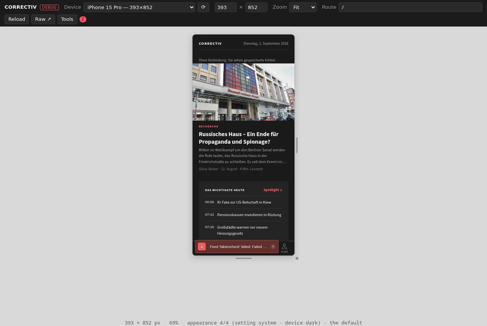
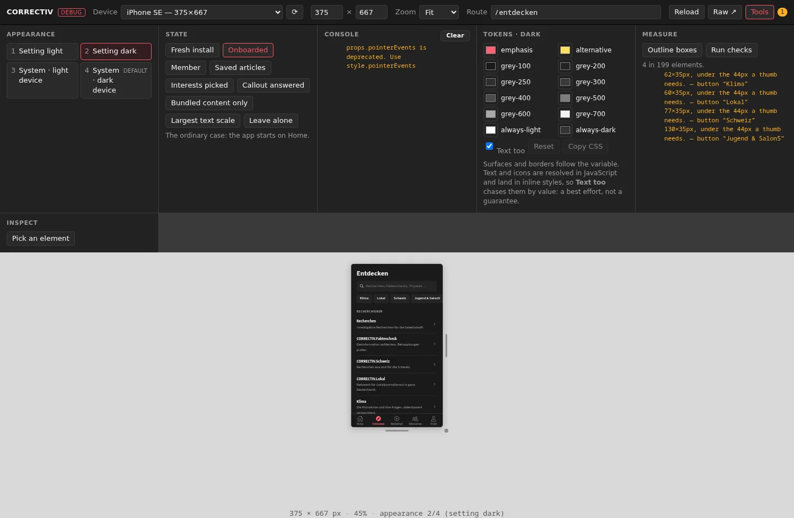
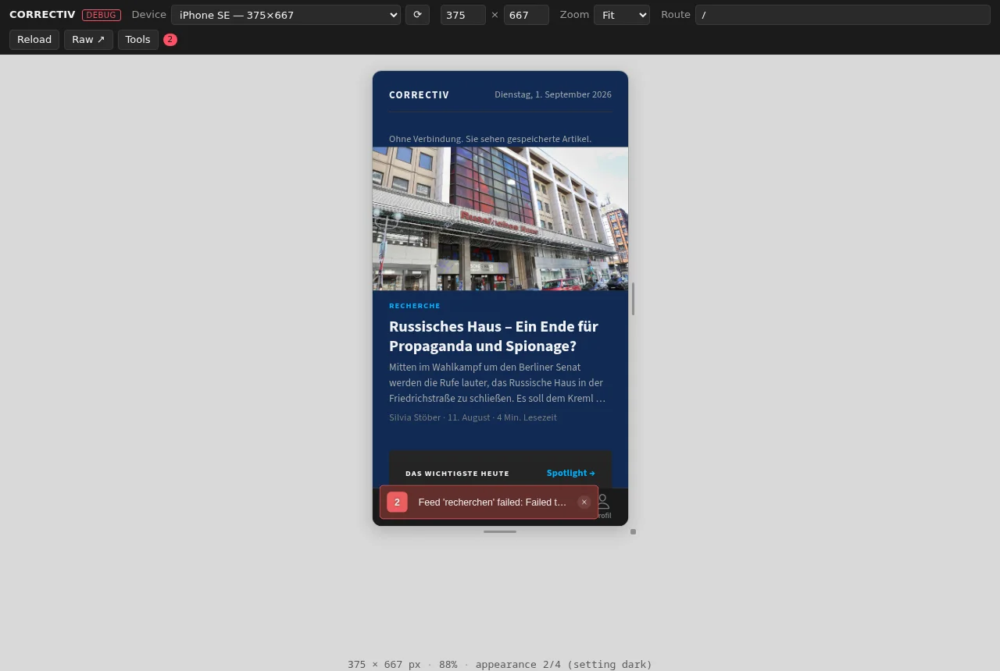
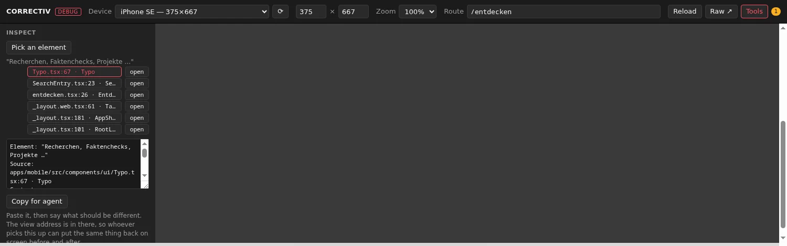

# @correctiv/preview

The device frame around the web build, and everything that has been added to it since
it stopped being only a device frame.

Two audiences on one page. Plain, it is the demo: the address `README.md` and
`RELEASE.md` hand out, a phone-sized frame with device presets, a route field and a
URL that carries both. With `Tools` on, it is the workbench: the app's appearance and
state, its console, the palette, the checks, and the source line behind an element.

Built by Vite into `apps/mobile/public/`, which is not a detail. See
[ADR 0014](../../adr/0014-the-preview-shell-as-a-package.md) before moving it.



With `Tools` on, and the checks run against `/entdecken` — every filter chip there is
35px tall, under the 44px a thumb needs:



The palette, overridden live. Nothing is written back; `Copy CSS` is how a proposal
leaves here:



## Running it

```bash
npm run web -w @correctiv/mobile         # builds this, then starts the dev server
open http://localhost:8081/preview.html

npm run preview:watch -w @correctiv/mobile   # rebuild the shell on change
```

Against a static export instead, which is what Pages serves:

```bash
npm run build:web
node screens/tools/serve-clean.mjs apps/mobile/dist 8099
open http://localhost:8099/preview.html
```

The difference between the two matters, and it is narrower than "dev only" suggests.
`expo export` sets `__DEV__` false, so the export carries no dev handle: the
appearance panel disables itself and says why, and `Inspect` comes back empty,
because a production bundle keeps no owner stacks and there is no `/symbolicate` to
ask. Everything else is same-origin DOM work and holds in both — the fixtures, the
console, the palette and the checks.

## The URL is the interface

Every control writes to the hash, and reading it back is how a finding is handed over
as a link rather than as a set of instructions.

```
preview.html#/artikel?d=ipad-mini&o=l&z=1&t=dark&s=signed-in&tools=1&check=1&kd=grey-100:102a54
```

| | |
| --- | --- |
| `d` `o` `z` `w` `h` | device, landscape, zoom, custom size — unchanged from before this package existed |
| `t` | appearance setting: `system`, `light`, `dark` |
| `s` | storage fixture: see `frame/seed.ts` |
| `tools` | show the panels |
| `check` | run the measure checks once the frame settles |
| `kl` `kd` | palette override per scheme, `token:hex,token:hex` |

`window.preview` is the same thing for something that is not a person:

```js
await preview.set({ route: '/mediathek', device: 'pixel-8', theme: 'dark' });
preview.get();      // state, plus what the frame actually reports back
preview.audit();    // the checks, as data
preview.logs();     // warnings and errors since the last navigation
```

`set()` resolves after the frame has settled — the navigation the patch causes, then
document parsed, webfonts decoded, two animation frames of quiet. That is the
difference between a screenshot of the app and a screenshot of its first paint, and it
is why `screens/README.md`'s "waiting for the feeds to settle" no longer needs a
person doing the waiting. What comes back is read out of the frame at that moment, not
out of the shell's last poll, so it cannot describe the page on its way out.

A driver with no promise to await has the same signal on the shell's own `<body>`,
which carries `data-state="loading"` from the moment a navigation is issued and
`data-state="ready"` once it has settled.

## What each panel is for

**Appearance.** The four combinations `TROUBLESHOOTING.md` insists on, named and
numbered as it numbers them. The shell sets the app's own setting; the device scheme is
the browser's to emulate, so 3 and 4 are reached in DevTools and the panel tells you
which one you are actually in. Combination 4 is the app's default and the one that has
already shipped broken.

**State.** Storage fixtures, written before the frame boots, which is what costs the
reload: `onboardingDone` and the feed cache are both read before the first render.
Picking one wipes the app's storage first, so a fixture is a whole state rather than a
patch on whatever was there. No `s` in the URL leaves that storage alone — the plain
demo link must not clear what the last visit left behind. A fixture needs no dev
handle either, because this page's `localStorage` is literally the app's, which makes
it the one way to change the app's state in the published export.

**Console.** The frame's warnings and errors. The blind spot it closes: a page that
looks finished in a screenshot while the console is red.

**Tokens.** The palette, live. Surfaces and borders follow the CSS variable; text and
icons are resolved in JavaScript into inline styles, so `Text too` chases those by
value — a best effort, not a guarantee. Nothing is written back: `tokens/theme.css` is
vendored from `wp-design-tokens`, and `Copy CSS` is how a proposal leaves here.

**Measure.** Sideways overflow, tap targets under 44px, and colours that are in no
token. Run the colour half in dark: in the light palette `#ffffff` is both `grey-100`
and `always-light`, so a value match cannot say which was meant.

**Inspect.** Click an element, get the file and line that drew it, and a button that
opens it in the editor. Dev server only, because React 19 keeps no source on a fiber:
this walks the owner chain and asks Metro's `/symbolicate` to map it back.

Picking is inert: choosing a link does not follow it. What is under the cursor is
outlined while the picker is armed, and what was picked stays outlined afterwards, so
a wrong hit is visible as a wrong hit rather than as a surprising file name.

What comes back is the whole chain, not one answer, because only the person looking
knows which level they mean. Selecting one makes it the `Source:` line of a block
built for handing over:

```
Element: "Klima"
Source:  apps/mobile/src/components/ui/Chip.tsx:31 · Chip
Context: apps/mobile/src/app/(tabs)/entdecken.tsx:88
View:    http://localhost:8081/preview.html#/entdecken?d=iphone-se&t=dark
```

`Copy for agent` puts that on the clipboard. Paste it into a chat, say what should be
different, and whoever picks it up has both halves: the line to change, and the
address that puts the same thing back on screen to check the change against.



## Layout

```
src/
  state.ts      the URL contract, and the only shape the shell has
  store.ts      one authority; the toolbar and window.preview both go through it
  api.ts        window.preview, and the one place a Status is assembled
  devices.ts    the size presets
  routes.ts     the list behind the route field
  logs.ts       what the console panel shows, bounded
  frame/        everything that reaches into the iframe
    handle.ts     the app's dev handle: appearance, route, the store
    ready.ts      when the frame has stopped moving
    seed.ts       storage fixtures
    console.ts    warnings and errors
    tokens.ts     the live palette
    measure.ts    the checks
    locate.ts     element to source line
  ui/           the chrome, which is deliberately not theme-aware
```

The shell's own colours never follow the app's. A toolbar that changed with the app
would make it impossible to tell, at a glance, which half of the screen just changed.
